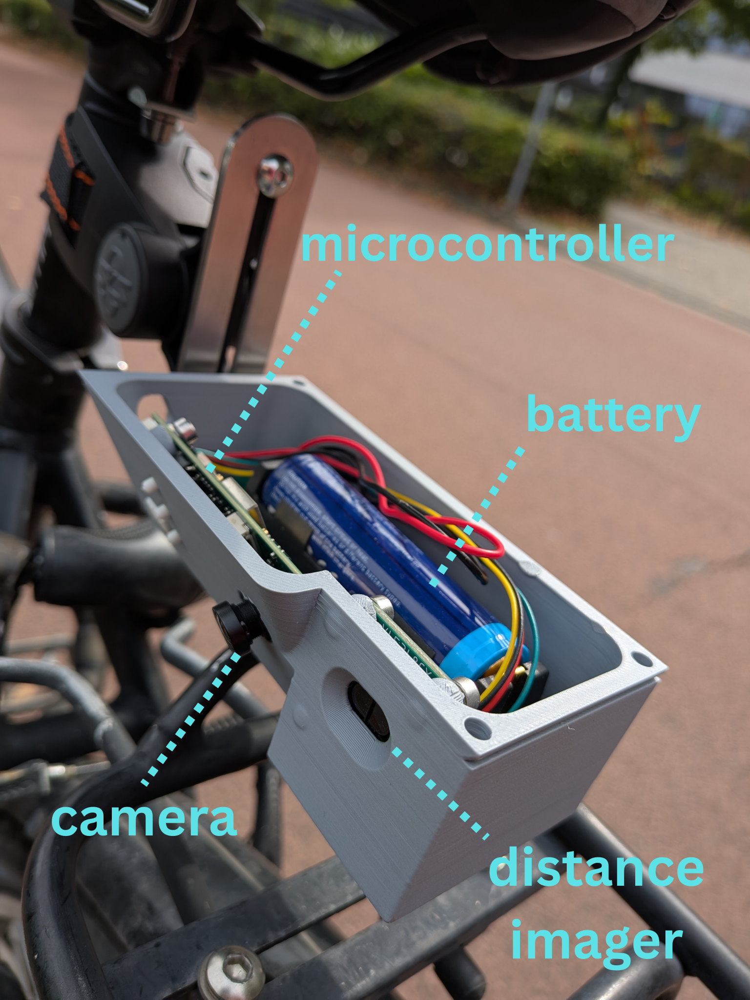
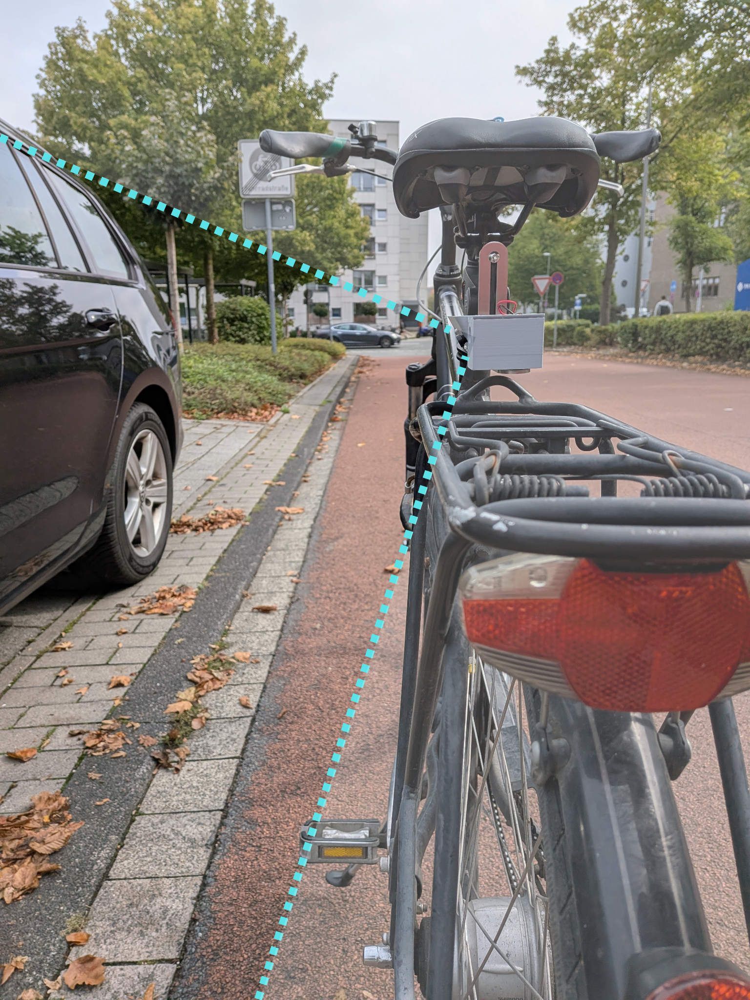

# cam-takeover-classification
Detecting dangerous takover maneuvers live with a microcontroller on a bicycle. But now with a camera!

## proposed system design (software)

- pytorch for model design, training and evaluation
- deployment in ESP-IDF

## proposed system design (hardware)

### ideas and future work
- calculate precision and recall per takeover GROUP (if one frame of a group is takeover, then the whole group is takeover)
