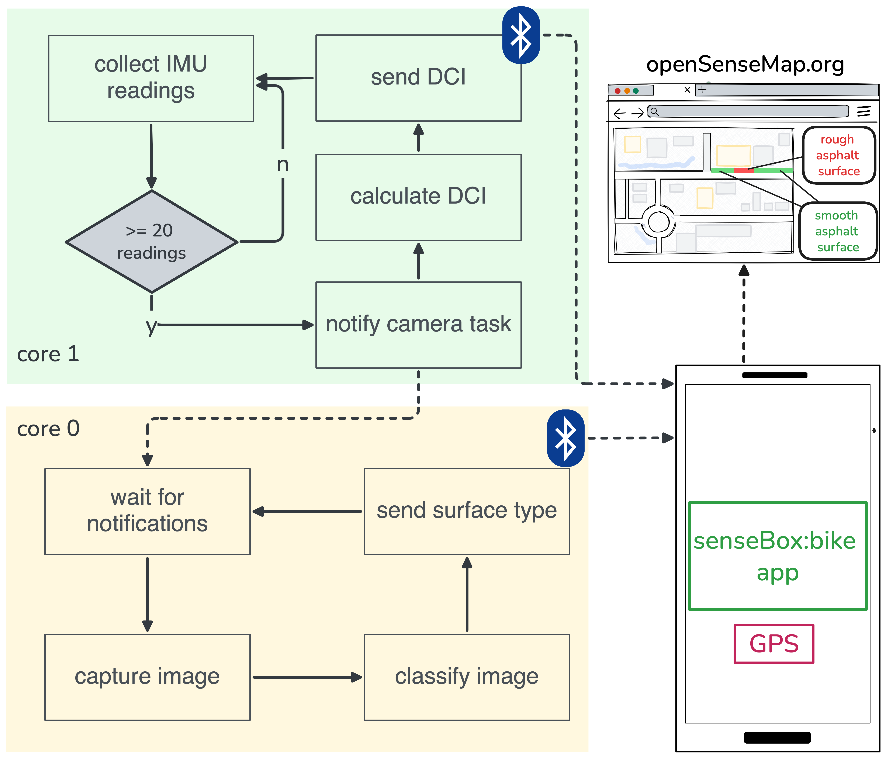

# Surface and Takeover classification

The camera captures an image and then triggers surface and takeover classification in parallel. Current framerate is 6.67 Hz. 

In order for the classification task to run indefinitely the watchdog timer has to be disabled in the settings.

Also the ToF will not be initialized correctly if the device is not powered off after a restart.

## TODO

- [ ] second ToF
- [ ] acceleration sensor?
- [ ] better models
    - more data
    - [x] grayscale
- refactoring
    - [ ] sensor class (+ class for classifications?)
    - [ ] clean up BLE
    - [ ] subfolders (somehow thats not trivial... I have issues with the cmake)
