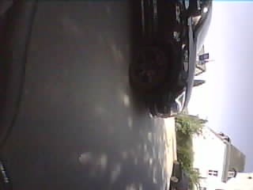
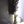
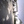
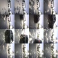

## tech-stack
This will be a bit different than the tof-takeover-detection.
We are going to base everything on ESP-IDF, so pytorch will be used for model design and training (instead of tensorflow).

# idea A: image stacking
## input format: idea A
- camera will record everything in QVGA (320x240). Such high resolution is necessary for the street surface classification.

- then left part of the image is cut off so that it is square. The result is the rescaled to 24x24 (maybe we could go even lower to 16x16 ?).

- these tiny images are then stacked so that the manoeuver becomes apparent. Perhaps 15 are stacked at a time

- so ultimately the model input will be: 24x24x3x15 (this is 20 times bigger than the ToF model input, which was 8x8x20)

Open Questions:
- how big should a frame be: 24x24?
- how big should the frame stack be: 15?
    - I think its fine for most
- do we need RGB? maybe grayscale is enough?
    - I think grayscale is enough
    - can we do that in ESP-IDF?
        - yup (`DL_IMAGE_PIX_TYPE_GRAY`)
- does stacking frames and feeding as input to the model even work in ESP-IDF?
    - we currently use `dl::image` a lot. I guess that wouldnt work.
    - all of the example models in esp-idf are image recognition :o
    - [legacy project from 2023: human activity recognition suing esp-dl](https://medium.com/the-esp-journal/esp32-s3-edge-ai-human-activity-recognition-using-accelerometer-data-and-esp-dl-3afa97ca553c)
- how can I label and store my data?
    - as csv? I guess
    - ok so I need a script, that converts my images to csv files. Then I need a script that visualizes each row, so that I can label it. Then I need to load the data.
    - ok, no
        - I will do folders of images. And then I will have a csv with labels for all these folders
- create demo data for now
    - to test model compression and loading. 

## model design
- could be self designed
- NAS
    - ask Benni about that

# idea B: image puzzle
## input format

- camera will record everything in QVGA (320x240). Such high resolution is necessary for the street surface classification.

- then left part of the image is cut off so that it is square. The result is the rescaled to 24x24 (maybe we could go even lower to 16x16 ?).

- these tiny images are then put together into a single image. perhaps like 16 of them into a 4x4. So the resulting image would have the shape 96x96(x3)

Open Questions:
- how big should a frame be: 24x24?
- grayscale? lets first try RGB
- can I combine the small images into a big one in ESP-IDF? pretty sure that yes, but lets test that at some point
- much later we can think about a custom model that internally changes the image format

## model design
- squeezenet